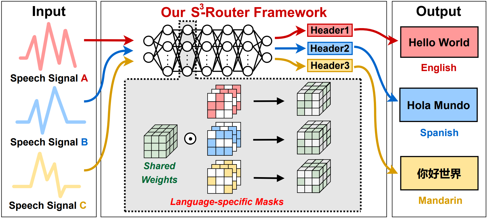
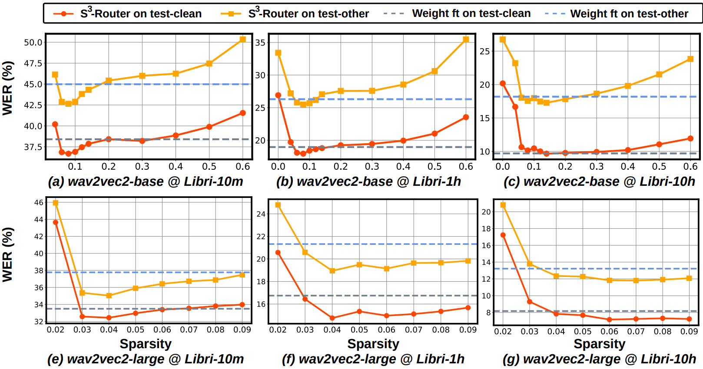
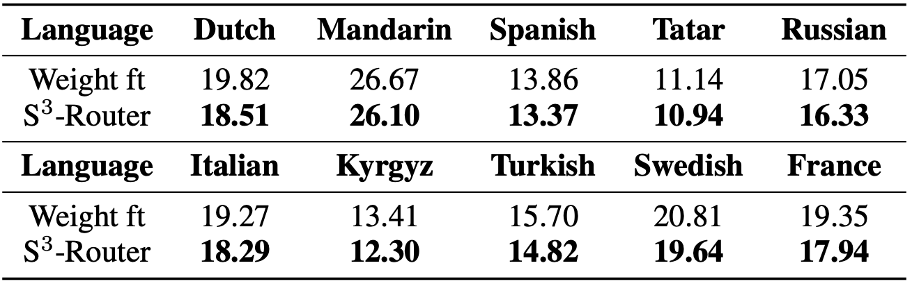
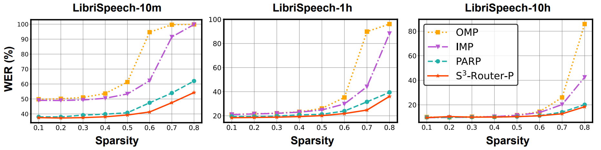
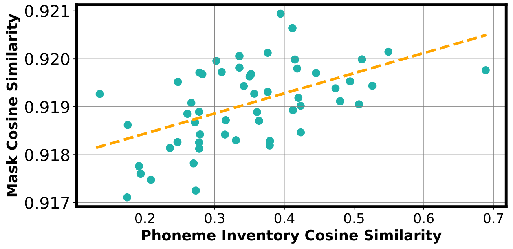

# Losses Can Be Blessings: Routing Self-Supervised Speech Representations Towards Efficient Multilingual and Multitask Speech Processing
**Yonggan Fu**, Yang Zhang, Kaizhi Qian, Zhifan Ye, Zhongzhi Yu, Cheng-I Lai, Yingyan (Celine) Lin

Accepted at NeurIPS 2022. [ [Paper](https://arxiv.org/pdf/2211.01522.pdf) | [Video](https://www.youtube.com/watch?v=eacbr28Ygn8&t=45s) | [Slide](https://drive.google.com/file/d/11NVFYijZ8g6Imt-tu4NjDxidyMveu-Gl/view?usp=sharing) ]


## S<sup>3</sup>-Router: Overview
- Self-supervised learning (SSL) for speech representations has achieved empirical success in low-resource Automatic Speech Recognition, while the resultant speech SSL models have become prohibitively large, limiting their deployment on resource-constrained devices. Additionally, strongly overparameterized speech SSL models tend to suffer from overfitting. This work aims to enhance the practical usage of speech SSL models towards *a win-win in both enhanced efficiency and alleviated overfitting* via our proposed **S<sup>3</sup>-Router** framework, which can serve as an all-in-one technique to enable *(1)* a new finetuning paradigm, *(2)* an efficient multilingual/multitask solution, *(3)* a SOTA ASR pruning scheme, and *(4)* a new tool to  analyze the learned speech representation.


## S<sup>3</sup>-Router: Framework
- **Key insights**: Model sparsity can not only favor efficiency, but also can serve as a similar role, i.e., another optimization knob, as model weights to encode language-/task-specific information.

- **Key idea**: Finetune model connections instead of model weights via optimizing language-/task-specific binary masks on top of shared weights inherited from pretrained speech SSL models.

<p align="center">
  
</p>


## S<sup>3</sup>-Router's Application 1: A New Finetuning Paradigm

- **Discarding ≤10% weights is all you need**: Consistently outperform the standard weight finetuning in the achievable word error rate.

- **Insight**: Tuning model connections instead of weights can reduce overfitting on low-resource speech.

<p align="center">
  
</p>


## S<sup>3</sup>-Router's Application 2: An Efficient Multilingual/Multitask Solution

- Simultaneously support the aforementioned 11 languages (10 languages below + English) with -88.5% parameters.


<p align="center">
  
</p>


## S<sup>3</sup>-Router's Application 3: A SOTA Pruning Scheme
- Achieve better or comparable pruning effectiveness over SOTA ASR pruning techniques across different resource settings.


<p align="center">
  
</p>


## S<sup>3</sup>-Router's Application 4: Analyze Speech SSL Models
- The similarity among binary masks learned on different languages by speech SSL models is highly correlated with their phonetic similarity defined by human experts.


<p align="center">
  
</p>


## Code Usage

Our code is built on top of [[Fairseq]](https://github.com/facebookresearch/fairseq).

### Installation

* **To install fairseq** and develop locally:

``` bash
git clone https://github.com/pytorch/fairseq
cd fairseq
pip install --editable ./
```

* **For faster training** install NVIDIA's [apex](https://github.com/NVIDIA/apex) library:

``` bash
git clone https://github.com/NVIDIA/apex
cd apex
pip install -v --no-cache-dir --global-option="--cpp_ext" --global-option="--cuda_ext" \
  --global-option="--deprecated_fused_adam" --global-option="--xentropy" \
  --global-option="--fast_multihead_attn" ./
```

* **Prepare the LibriSpeech/CommonVoice datasets** following [wav2vec 2.0](https://github.com/facebookresearch/fairseq/tree/main/examples/wav2vec) in Fairseq.


### Finetune wav2vec 2.0 @ LibriSpeech via S<sup>3</sup>-Router
- Finetune [wav2vec 2.0](https://arxiv.org/pdf/2006.11477.pdf) on LibriSpeech-1h with a sparsity of 10%:

```
CUDA_VISIBLE_DEVICES=0,1 fairseq-hydra-train task.data=path-to-librispeech  model.w2v_path=path-to-wav2vec_small.pt dataset.train_subset=train-1h dataset.valid_subset=test-clean hydra.run.dir=outputs/wav2vec2-base dataset.max_tokens_valid=800000  dataset.max_tokens=1200000 distributed_training.distributed_init_method=tcp://localhost:15460 model._name=wav2vec_ctc_st model.prune_rate=0.9 checkpoint.no_epoch_checkpoints=false checkpoint.save_interval=1000 optimization.lr=[0.00005] model.fix_attn=true model.trainable_proj=true lr_scheduler.final_lr_scale=0.0001 model.init_score=weight_rank --config-dir examples/wav2vec/config/finetuning --config-name base_1h
```

### Finetune data2vec @ LibriSpeech via S<sup>3</sup>-Router
- Finetune [data2vec](https://arxiv.org/pdf/2202.03555.pdf) on LibriSpeech-1h with a sparsity of 10%:

```
CUDA_VISIBLE_DEVICES=0,1 fairseq-hydra-train task.data=path-to-librispeech model.w2v_path=path-to-audio_base_ls.pt dataset.train_subset=train-1h dataset.valid_subset=test-clean hydra.run.dir=outputs/data2vec dataset.max_tokens_valid=800000  dataset.max_tokens=1200000 distributed_training.distributed_init_method=tcp://localhost:15460 task.normalize=true model._name=wav2vec_ctc_st model.prune_rate=0.9 checkpoint.no_epoch_checkpoints=false checkpoint.save_interval=1000 optimization.lr=[0.00005] model.fix_attn=true model.trainable_proj=true lr_scheduler.final_lr_scale=0.0001 common.user_dir=examples/data2vec --config-dir examples/wav2vec/config/finetuning --config-name base_1h
```

### Finetune xlsr @ CommonVoice via S<sup>3</sup>-Router

- Finetune [xlsr](https://arxiv.org/pdf/2111.09296.pdf) on Mandarin @ CommonVoice with a sparsity of 6%:

```
CUDA_VISIBLE_DEVICES=0,1 fairseq-hydra-train task.data=path-to-commonvoice-zh_TW-train model.w2v_path=path-to-xlsr2_300m.pt dataset.train_subset=zh_TW-train dataset.valid_subset=zh_TW-test hydra.run.dir=outputs/xlsr dataset.max_tokens_valid=800000 dataset.max_tokens=1200000 distributed_training.distributed_init_method=tcp://localhost:15460 model._name=wav2vec_ctc_st model.prune_rate=0.94 model.checkpoint_activations=true checkpoint.no_epoch_checkpoints=false checkpoint.save_interval=1000 optimization.lr=[0.00005] model.trainable_proj=true model.fix_attn=true checkpoint.best_checkpoint_metric=uer  model.init_score=weight_rank lr_scheduler.final_lr_scale=0.0001 --config-dir examples/wav2vec/xlsr/config --config-name finetune
```

### Pruning wav2vec 2.0 @ LibriSpeech via S<sup>3</sup>-Router 

- [**Step 1**] Finetune wav2vec 2.0 using standard weight finetuning on LibriSpeech-1h:

```
CUDA_VISIBLE_DEVICES=0,1 fairseq-hydra-train task.data=path-to-librispeech  model.w2v_path=path-to-wav2vec_small.pt dataset.train_subset=train-1h     dataset.valid_subset=test-clean hydra.run.dir=outputs/finetune dataset.max_tokens_valid=800000  dataset.max_tokens=1200000 distributed_training.distributed_init_method=tcp://localhost:15460 model._name=wav2vec_ctc checkpoint.no_epoch_checkpoints=false checkpoint.save_interval=1000 optimization.lr=[0.00005] --config-dir examples/wav2vec/config/finetuning --config-name base_1h
```

- [**Step 2**] Prune finetuned wav2vec 2.0 on LibriSpeech-1h via S<sup>3</sup>-Router with a sparsity of 70%:

```
CUDA_VISIBLE_DEVICES=0,1 fairseq-hydra-train task.data=path-to-librispeech  model.w2v_path=path-to-wav2vec_small.pt dataset.train_subset=train-1h     dataset.valid_subset=test-clean hydra.run.dir=outputs/pruning_wav2vec2 dataset.max_tokens_valid=800000  dataset.max_tokens=1200000 distributed_training.distributed_init_method=tcp://localhost:15460 model._name=wav2vec_ctc_st model.prune_rate=0.3 checkpoint.no_epoch_checkpoints=false checkpoint.save_interval=1000 optimization.lr=[0.00005] model.fix_attn=false model.trainable_proj=true lr_scheduler.final_lr_scale=0.0001 model.init_score=weight_magnitude_with_scale checkpoint.finetune_from_model=outputs/finetune/checkpoints/checkpoint_best.pt --config-dir examples/wav2vec/config/finetuning --config-name base_1h
```


## Citation
- If you find our work interesting or helpful to your research, welcome to cite our paper:

```
@article{fu2022losses,
  title={Losses Can Be Blessings: Routing Self-Supervised Speech Representations Towards Efficient Multilingual and Multitask Speech Processing},
  author={Fu, Yonggan and Zhang, Yang and Qian, Kaizhi and Ye, Zhifan and Yu, Zhongzhi and Lai, Cheng-I and Lin, Yingyan},
  journal={arXiv preprint arXiv:2211.01522},
  year={2022}
}
```


